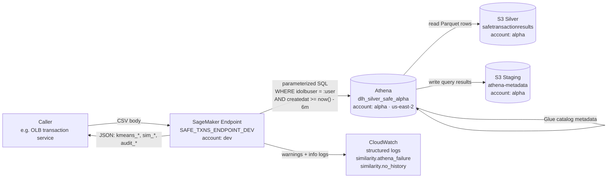
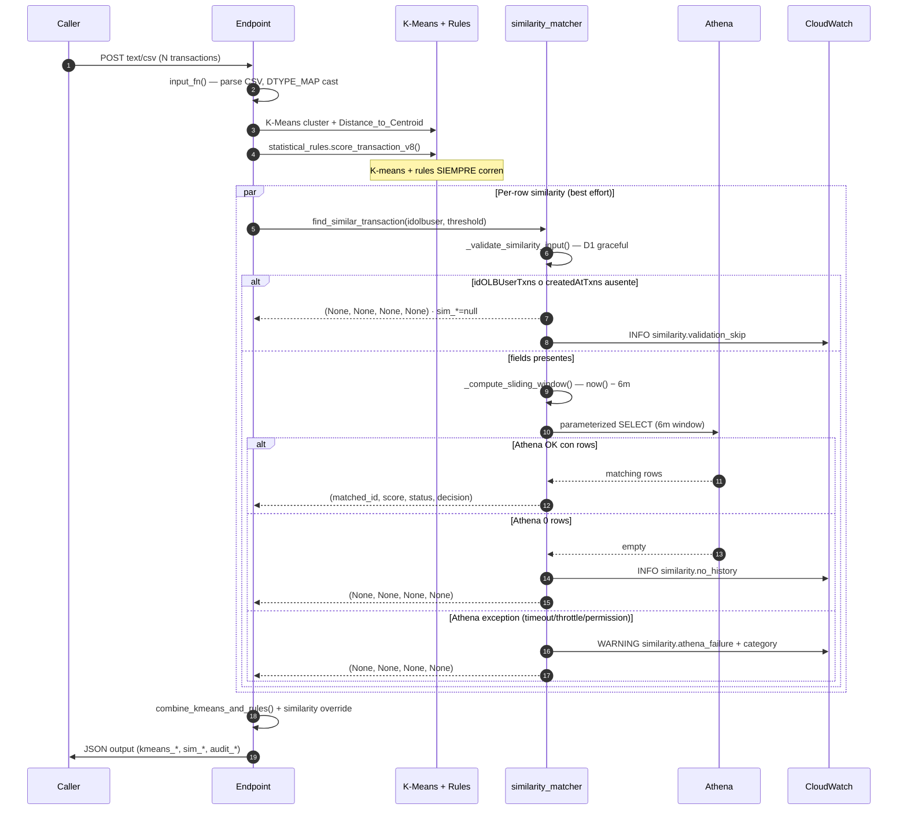

# Architecture

## Sistema de alto nivel

## Componentes

### Endpoint (SageMaker, cuenta development)

- Contenedor SKLearn 1.2-1 CPU, ml.m5.large × 1 instancia
- Carga: `kmeans_model.joblib`, `preprocessing_pipeline.joblib`, `centroids.csv`, `selected_features.csv`, `kmeans_artifacts.json`
- Código: [[01-endpoint/README]] — `inference_rules.py` (orquesta), `similarity_matcher.py` (Athena loader), `statistical_rules.py` (R1–R12), `schema_validator.py`
- Handlers SageMaker: `model_fn`, `input_fn`, `predict_fn`, `output_fn` — ver [[01-endpoint/Public-API]]

### Data lake (cuenta alpha, region us-east-2)

- **Glue catalog**: `dlh_silver_safe_alpha.safetransactionresults` (Hive partitioning por `createdat_month=YYYY-MM`)
- **S3 Silver**: `s3://blossom-analytics-datalake-alpha/datalake/silver/SAFE/safetransactionresults/data/`
- **S3 staging Athena**: `s3://blossom-analytics-datalake-alpha/datalake/gold/athena-metadata/`
- Cross-account: el endpoint en **development** lee del lake en **alpha** — requiere assume-role policy

### Pipeline de ingesta (offline, ver [[04-data-eng/README]])

Bronze (.gz JSON CDC) → Silver (Parquet) → Athena Glue catalog. No se ejecuta en línea con el endpoint; corre en jobs separados.

## Request flow — predict

## Layers y separación de responsabilidades

| Layer | Responsabilidad | Files |
|---|---|---|
| **Input contract** | Validar payload, cast tipos, derivar features temporales | `inference_rules.input_fn`, `DTYPE_MAP`, `_validate_similarity_input` |
| **K-Means baseline** | Cluster + distancia + score base | `inference_rules.predict_fn` L900–980 |
| **Rules layer** | R1–R12, normalización piecewise 0–100, classify_risk | `statistical_rules.score_transaction_v8` |
| **Similarity stage** | Athena loader + cosine similarity + null fallback | `similarity_matcher.find_similar_transaction` |
| **Combiner** | Override por similarity high-confidence; audit_* fields | `inference_rules.combine_kmeans_and_rules` |
| **Observability** | Structured logs con `_hash_idolbuser`, `classify_exception` | `similarity_matcher` L40–110 |

K-Means + Rules + Similarity son **procesos paralelos independientes** — ver [[Graceful-Degradation]]. Cualquier falla de similarity deja `sim_*=null`; K-means y reglas siempre producen su resultado.

## Deployment topology

- **Dev (developer machine):** corre tests locales con `pytest tests/`, simulación con `tests/integration/test_local_integration.py`, invocación real con `tests/process_endpoint.py`.
- **SageMaker (cuenta development):** endpoint productivo `SAFE_TXNS_ENDPOINT_DEV`. Deploy via [[02-deploy/README]] scripts.
- **Athena/Glue/S3 (cuenta alpha):** data lake compartido. El endpoint requiere permisos cross-account (`athena:*`, `s3:GetObject`, `glue:GetTable`, `glue:GetPartitions`).

## Cross-account IAM (riesgo top-level activo)

El rol de ejecución del endpoint en development necesita:

- `athena:StartQueryExecution`, `athena:GetQueryExecution`, `athena:GetQueryResults` en `us-east-2`
- `s3:GetObject`, `s3:PutObject`, `s3:ListBucket` sobre `blossom-analytics-datalake-alpha/datalake/gold/athena-metadata/`
- `s3:GetObject` sobre `blossom-analytics-datalake-alpha/datalake/silver/SAFE/safetransactionresults/data/`
- `glue:GetTable`, `glue:GetPartitions` sobre `dlh_silver_safe_alpha.safetransactionresults`

Validación: post-deploy en alpha + monitoreo CloudWatch 24h del log `similarity.athena_failure` con `category=permission`. Ver [[changes/DATA-1264/plan.md]] para el contexto de riesgo aceptado.

## Backlinks

- [[Agent-Memory]]
- [[Glossary]]
- [[Index]]
- [[Public-API]]
- [[README]]
- [[SDD-Workflow]]
- [[Similarity-Athena]]
- [[Tech-Stack]]

#architecture #sagemaker #athena #cross-account #ml-endpoint
