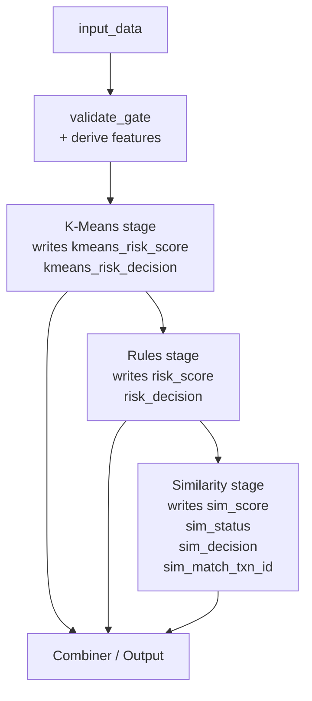

# Graceful Degradation

Contrato de robustez del endpoint. Su tesis es **simple pero contraintuitiva**: K-Means, reglas estadísticas y similitud son **tres procesos paralelos independientes**, no una cadena con fallback.

## El malentendido común (NO es esto)

```
K-Means → Reglas → Similitud
                        ↓ falla
                        Vuelve a K-Means como "fallback"
```

❌ **Esto es incorrecto.** Esa lectura sugiere una try/catch donde si similitud rompe se "vuelve" a K-Means. No existe tal vuelta — K-Means **ya corrió antes**.

## Cómo realmente funciona (SÍ es esto)



- K-Means escribe en `out_df` y **nunca** se sobrescribe.
- Reglas escriben sus columnas y nunca tocan las de K-Means.
- Similitud escribe `sim_*` y nunca toca `kmeans_*` ni las columnas de reglas.

Cuando hablamos de "fallback", lo que pasa es: si la rama de similitud falla, sus columnas (`sim_*`) quedan en `None`. K-Means y reglas ya tienen su resultado escrito desde antes. El output del endpoint sigue siendo válido — solo trae menos info en las columnas `sim_*`.

## Invariantes

| Condición | `kmeans_*` | `risk_*` (rules) | `sim_*` |
|---|---|---|---|
| Caso normal | valor | valor | valor |
| `idOLBUserTxns` ausente / null | valor | valor | **null** (D1) |
| `createdAtTxns` ausente / null | valor | valor | **null** (D1) |
| Athena timeout | valor | valor | **null** + log warning |
| Athena throttling | valor | valor | **null** + log warning |
| Athena permission error | valor | valor | **null** + log warning category=`permission` |
| Athena 0 rows (usuario sin historial) | valor | valor | **null** + log info `no_history` |
| Glue catalog drift | valor | valor | **null** + log warning category=`query_error` |
| `DISABLE_SIMILARITY=1` | valor | valor | **null** |
| `DISABLE_RULES=1` | valor | **default 0** | valor |

**Invariante crítica:** `kmeans_risk_score` y `kmeans_risk_decision` siempre vienen con valor. Cualquier consumer del endpoint puede tomar una decisión con ellos solos.

## D1 — Input contract validation

Función `_validate_similarity_input(input_data)` en `inference_rules.py` L695–756. Por row valida que:

1. `idOLBUserTxns` está presente y castable a int.
2. `createdAtTxns` está presente y no-null.

Si falla alguno → registra el índice del row en `sim_skip_rows`. El bloque de similitud (`predict_fn` L1121+) salta esos rows con `sim_*=None`. **No lanza excepción, no retorna 400.**

Razonamiento (decisión DATA-1264 D1): K-Means + reglas no deberían perder su decisión porque falte un campo que solo afecta similitud. Coherente con el principio de procesos paralelos independientes.

## Two-path observability (F5+ del threats.md)

```python
# Path A: 0 rows — INFO, ruido normal, NO alerta
logger.info("similarity.no_history", extra={
    "idolbuser_hash": _hash_idolbuser(idolbuser),  # sha256[:16]
    "window_months": 6,
    "rows": 0
})

# Path B: exception — WARNING, alertable
logger.warning("similarity.athena_failure", extra={
    "idolbuser_hash": _hash_idolbuser(idolbuser),
    "exception_class": exc.__class__.__name__,
    "exception_message": str(exc)[:200],  # truncado anti log injection
    "category": classify_exception(exc),
})
```

CloudWatch alarm: disparar sobre `similarity.athena_failure` cuando `count > N/min`. Si `category=permission` aparece → cross-account IAM roto → escalar a platform team. Path A es normal y no alerta.

## PII compliance

- `idOLBUser` **NUNCA** se loguea en plaintext. Siempre via `_hash_idolbuser()` → sha256 truncado a 16 chars.
- Excepción messages se truncan a 200 chars para evitar log injection.
- `exception_message` y `exception_class` se loguean estructurados (no concatenados).

## Tests que enforzan estas invariantes

- `tests/endpoint/test_graceful_degradation.py` — casos de Athena empty, exception, permission.
- `tests/similarity/test_athena_similarity_input_contract.py` — D1 validation.
- `tests/similarity/test_athena_similarity_logging.py` — los dos paths INFO + WARNING + categories.
- `endpoint/inference_rules.py` tests embebidos (T3, T_LOGGING en `changes/DATA-1264/spec.md`).

## Files

- `endpoint/inference_rules.py` — `_validate_similarity_input` (L695–756), bloque similarity (L1049–1130)
- `endpoint/similarity_matcher.py` — `classify_exception`, `_hash_idolbuser`, try/except wrappers
- `docs/GRACEFUL_DEGRADATION.md` — guía detallada

## See also

- [[Similarity-Athena]] — el detalle de la rama opcional
- [[K-Means-Pipeline]] — la rama baseline siempre activa
- [[Statistical-Rules]] — la rama de reglas

## Backlinks

- [[Agent-Memory]]
- [[Architecture]]
- [[Index]]
- [[K-Means-Pipeline]]
- [[README]]
- [[Similarity-Athena]]
- [[Statistical-Rules]]

#concept #graceful-degradation #parallel-processes #d1 #observability
