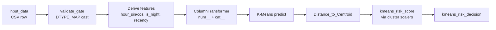

# K-Means Pipeline

El **baseline obligatorio** del endpoint. Siempre corre — no depende de Athena, no depende del payload tener `idOLBUserTxns`, no depende de las reglas. Si todo lo demás falla, K-Means sigue dando una decisión.

## Flujo



## Artefactos cargados en `model_fn`

| Archivo | Propósito |
|---|---|
| `kmeans_model.joblib` | Modelo entrenado con `n_clusters` definido |
| `preprocessing_pipeline.joblib` | `ColumnTransformer` con `StandardScaler` para `num__*` y `OneHotEncoder` para `cat__*` |
| `selected_features.csv` | Lista de columnas que el modelo espera (whitelist) |
| `centroids.csv` | Coordenadas de cada centroide |
| `kmeans_artifacts.json` | Scalers `below`/`above` por cluster + thresholds de outlier |

## Outputs

| Columna | Tipo | Descripción |
|---|---|---|
| `Cluster` | int | ID del cluster asignado (0..N-1) |
| `Distance_to_Centroid` | float | Distancia euclidiana al centroide |
| `kmeans_risk_score` | int 0–100 | Score derivado del cluster + distancia + scalers |
| `kmeans_risk_decision` | str | Decisión: `Accept`, `User Auth`, `Admin Review`, `Reject` |
| `is_outlier` | bool | True si `Distance_to_Centroid > threshold(cluster)` |

## Patrón de scoring

Para cada cluster, `kmeans_artifacts.json` define:

```json
{
  "0": {
    "threshold": 3.5,
    "scaler_below": {"a": ..., "b": ...},
    "scaler_above": {"a": ..., "b": ...}
  },
  "1": { ... }
}
```

- Si `Distance < threshold` → score via `scaler_below(distance)` (rango bajo, ~Accept)
- Si `Distance >= threshold` → score via `scaler_above(distance)` (rango alto, escala hacia Reject)
- `is_outlier = (Distance >= threshold)`

Esto permite que **cada cluster** tenga su propia función de scoring — clusters de comportamiento normal son sensibles a outliers, clusters de comportamiento ya-riesgoso escalan más rápido.

## Independencia de reglas y similitud

K-Means corre en `predict_fn` **antes** del bloque de reglas y **antes** del bloque de similitud (`endpoint/inference_rules.py` L900–991). Sus outputs (`kmeans_risk_score`, `kmeans_risk_decision`) se escriben en `out_df` y **nunca se sobrescriben** por las etapas posteriores.

- Si las reglas fallan o se desactivan (`DISABLE_RULES=1`) → K-Means igual da score.
- Si similitud falla (Athena exception) → K-Means igual da score.
- Si el payload no tiene `idOLBUserTxns` → K-Means igual da score (`sim_*=null`).

Ver [[Graceful-Degradation]] para el contrato completo.

## Files

- `endpoint/inference_rules.py` — `model_fn`, `validate_gate`, `predict_fn` (L900–991 es el bloque K-means)
- `endpoint/schema_validator.py` — valida que el modelo cargado tenga las 58 features esperadas

## See also

- [[Statistical-Rules]] — la rama paralela de reglas que también corre siempre
- [[Similarity-Athena]] — la rama opcional aditiva
- [[Graceful-Degradation]] — invariantes que se mantienen aunque falle todo lo demás

## Backlinks

- [[Graceful-Degradation]]
- [[Index]]
- [[README]]
- [[Similarity-Athena]]
- [[Statistical-Rules]]

#concept #k-means #baseline #ml-endpoint
