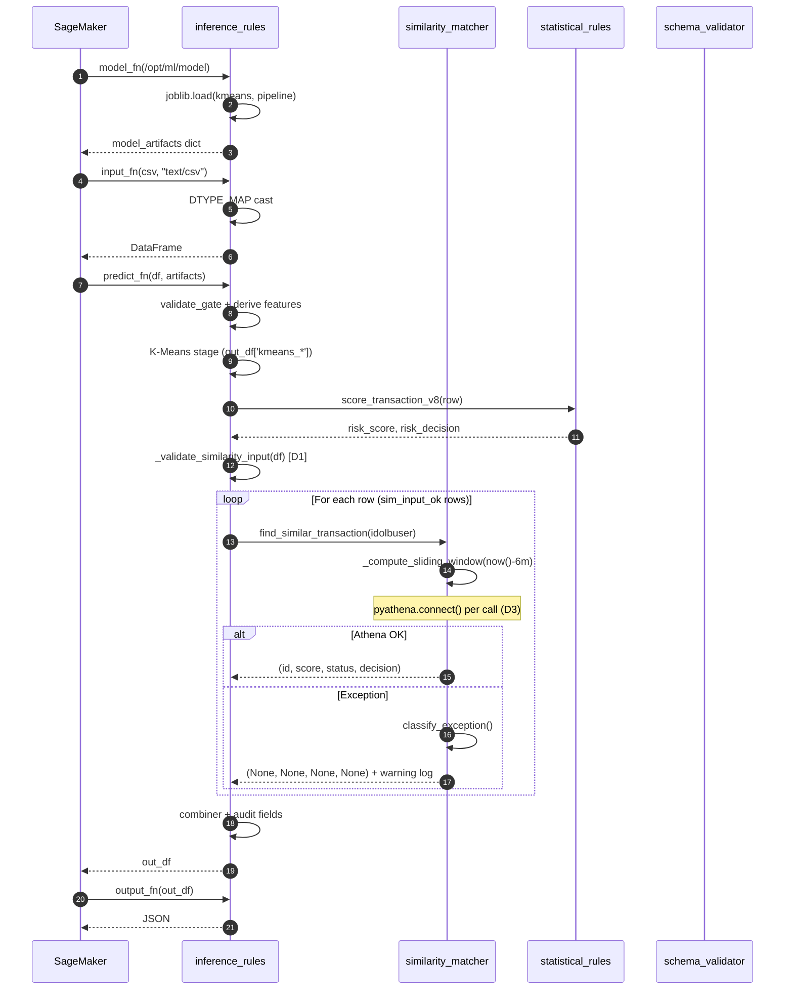

# Endpoint

**Path:** `endpoint/`
**Maintainers:** Landneyker Betancourth (Data Science — Safe Transactions)

## Purpose

Código que vive dentro del contenedor SageMaker. Orquesta K-Means + reglas estadísticas + similarity matching contra Athena para producir un score de riesgo 0–100 + decisión multi-nivel (Accept / User Auth / Admin Review / Reject) por transacción.

## Public surface

Las 4 funciones que SageMaker invoca por contrato:

| Handler | Cuándo | Qué hace |
|---|---|---|
| `model_fn(model_dir)` | 1× al cargar el contenedor | Carga joblib del modelo K-means, pipeline de preprocesamiento, scalers por cluster |
| `input_fn(request_body, content_type)` | Por request | Parsea `text/csv` → DataFrame, aplica `DTYPE_MAP` cast |
| `predict_fn(input_data, model_artifacts)` | Por request | Pipeline completo K-means + reglas + similarity; escribe N rows en `out_df` |
| `output_fn(prediction, accept)` | Por request | Serializa `out_df` → JSON |

Ver detalle en [[01-endpoint/Public-API]].

## Internal structure

```
endpoint/
├── inference_rules.py       — orquestador principal (~1285 líneas). model_fn, predict_fn, DTYPE_MAP, validate_gate, combiner
├── similarity_matcher.py    — Athena loader + cosine similarity (~1100 líneas). find_similar_transaction, classify_exception, _hash_idolbuser
├── statistical_rules.py     — Reglas v8 R1-R12 (~354 líneas). score_transaction_v8, classify_risk, piecewise normalization
├── schema_validator.py      — Validación del schema esperado (~387 líneas). 58 num__+cat__ features + 5 post-processing fields
├── validate_s3_data.py      — CLI para validar reference data en S3 (~238 líneas, herramienta offline)
├── test_csv_loading.py      — Test embebido para CSV loading
└── requirements.txt         — pyathena, python-dateutil, pyarrow, boto3
```

## Key files

| File | Purpose |
|---|---|
| `inference_rules.py` | Pipeline completo. Si tocás algo del flujo de inferencia, va acá. Las decisiones D1–D5 de DATA-1264 viven aquí. |
| `similarity_matcher.py` | Todo lo de Athena + similarity. La query parametrizada, la sliding window, classify_exception, hash de PII. |
| `statistical_rules.py` | Solo las 12 reglas. Si querés agregar una R13 o ajustar pesos, va acá. |
| `schema_validator.py` | Schema enforcement. Si agregás features, hay que actualizar la lista esperada. |
| `requirements.txt` | Las deps que se empaquetan en el tarball. **No agregar deps sin testear en el SKLearn 1.2-1 image.** |

## Architecture



## Patterns

- **Lazy imports.** `similarity_matcher` y `statistical_rules` se importan con `importlib.import_module()` en la primera call, cacheados en `_similarity_mod` y `_rules_mod`. Disabled vía env vars `DISABLE_SIMILARITY=1` / `DISABLE_RULES=1`.
- **DTYPE_MAP.** Cast explícito de tipos en `input_fn`. Convierte columnas float que llegan como CSV string. `idOLBUserTxns` se castea a `int64` cuando no es null.
- **Graceful degradation.** Ver [[Graceful-Degradation]]. Tres procesos paralelos independientes; cualquier falla no rompe el resultado base.
- **Structured logging.** Toda salida a CloudWatch va con `extra={...}` para que sea parseable. `idOLBUser` siempre via `_hash_idolbuser` (sha256[:16]).
- **Parameterized SQL.** Athena queries usan `cursor.execute(sql, params)`, nunca f-string.
- **On-demand connection.** `pyathena.connect()` por call, no singleton.

## Business rules

- **K-Means corre siempre.** Aunque las reglas o similarity fallen, K-Means produce `kmeans_risk_score` y `kmeans_risk_decision`.
- **Reglas corren siempre** (a menos que `DISABLE_RULES=1`).
- **Similarity es aditiva.** Cuando hay datos en la ventana Athena → `sim_*` con valor. Si no → `sim_*=null`. Nunca borra `kmeans_*`.
- **D1 validation:** `idOLBUserTxns` y `createdAtTxns` requeridos en payload → ausentes → `sim_*=null` por ese row, sin error 400.
- **6 meses sliding desde now()**, calculado en cada call. NUNCA en `model_fn()`.
- **`SELECT` con columnas explícitas** (no `SELECT *`) — incluye `metadata` que tiene info de similitud.

## Dependencies

**Internal:** —
**External:**
- `pyathena>=3.0,<4` — Athena DB-API client
- `python-dateutil>=2.8` — `relativedelta(months=6)`
- `pyarrow>=12` — Parquet (legacy / offline tools)
- `boto3` — S3, STS
- (implícitas en image SKLearn 1.2-1) — `pandas`, `numpy`, `scikit-learn`, `scipy`, `joblib`

## Tests

- Tests internos: `endpoint/test_csv_loading.py`
- Tests externos (en módulo `test/`): ~10 archivos pytest. Ver [[03-test/README]]
- Correr suite: `pytest test/test_athena_similarity_*.py test/test_graceful_degradation.py -v`

## Sub-features

- [[01-endpoint/Public-API]] — handlers SageMaker

## Related concepts

- [[K-Means-Pipeline]] — la rama baseline
- [[Statistical-Rules]] — la rama de reglas
- [[Similarity-Athena]] — la rama opcional aditiva
- [[Graceful-Degradation]] — contrato de robustez
- [[Architecture]] — sistema completo

## Backlinks

- [[Agent-Memory]]
- [[Architecture]]
- [[Module-Map]]
- [[Public-API]]

#endpoint #sagemaker #ml-endpoint #inference
