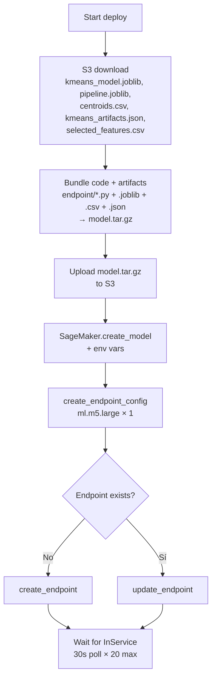

# Deploy

**Path:** `deploy/`
**Maintainers:** Landneyker Betancourth

## Purpose

Scripts Python que empaquetan el código de [[01-endpoint/README]] + artefactos del modelo en un tarball y lo despliegan al endpoint SageMaker `data-safe-txns-endpoint`. Configura las env vars de Athena (cross-account dev→alpha).

## Public surface

| Script | Cuándo se usa |
|---|---|
| `python deploy_with_sdk.py` | Deploy "limpio" cuando ya tenés `model.tar.gz` empaquetado en S3 |
| `python deploy_similarity_endpoint.py` | Deploy completo end-to-end: descarga artefactos de S3, empaqueta, sube, registra modelo, crea/actualiza endpoint |
| `python deploy_notebook.py` | Meta-script que extrae el código de deploy del notebook para reproducibilidad |

## Internal structure

```
deploy/
├── deploy_with_sdk.py            (51 líneas) — wrapper de alto nivel via SageMaker SDK
├── deploy_similarity_endpoint.py (207 líneas) — orquestación completa
└── deploy_notebook.py            (64 líneas) — extract code from notebook
```

## Flow



## Key files

| File | Purpose |
|---|---|
| `deploy_similarity_endpoint.py` | Orquestación full. Si vas a redeplear el endpoint con cambios de código, este es el script. |
| `deploy_with_sdk.py` | Versión simple con SageMaker SDK. Usa `SKLearnModel` abstraction. |

## Dependencies

- `boto3` — clientes de S3, SageMaker, STS
- `sagemaker` (SDK) — abstracción `SKLearnModel` y `Model.deploy()`
- AWS IAM role: `AmazonSageMaker-ExecutionRole-20241029T103557` (account 436631265256)
- Framework version: `scikit-learn 1.2-1 CPU` (image base del contenedor)
- AWS profile: `blossom-dev` (configurado en setup_sagemaker.sh)

## Configuración / env vars

El deploy inyecta env vars en el contenedor:

| Env var | Valor | Razón |
|---|---|---|
| `SIMILARITY_THRESHOLD` | `0.90` | Umbral para `matched=True` |
| `SIMILARITY_ATHENA_DATABASE` | `dlh_silver_safe_alpha` | Glue DB |
| `SIMILARITY_ATHENA_TABLE` | `safetransactionresults` | Tabla |
| `SIMILARITY_ATHENA_S3_STAGING` | `s3://blossom-analytics-datalake-alpha/datalake/gold/athena-metadata/` | Bucket de staging Athena (cross-account) |
| `SIMILARITY_ATHENA_REGION` | `us-east-2` | Region de Athena (cross-account, diff del endpoint) |
| `ATHENA_WINDOW_MONTHS` | `6` | Tamaño ventana sliding |
| `ATHENA_TIMEOUT_SECONDS` | `10` | Timeout por query |

(Antes de DATA-1264 había env vars de S3 Parquet — fueron removidas. Athena es la única fuente.)

## Cross-account IAM

El rol del endpoint en **development** debe tener policies para:

- Athena (`StartQueryExecution`, `GetQueryExecution`, `GetQueryResults`) en us-east-2 de cuenta alpha
- S3 (`GetObject`, `PutObject`, `ListBucket`) sobre `blossom-analytics-datalake-alpha/datalake/gold/athena-metadata/` (staging)
- S3 (`GetObject`) sobre `blossom-analytics-datalake-alpha/datalake/silver/SAFE/safetransactionresults/data/`
- Glue (`GetTable`, `GetPartitions`) sobre `dlh_silver_safe_alpha.safetransactionresults`

Si falta cualquiera → el endpoint despliega OK pero `similarity_matcher` logueará `similarity.athena_failure` con `category=permission`. Ver [[Graceful-Degradation]].

## Patterns

- **Idempotent update.** Si el endpoint ya existe, hace `update_endpoint`; si no, `create_endpoint`. Mismo nombre.
- **Waiter post-deploy.** Polling de 30s × 20 = ~10 min máximo hasta `InService`.
- **No source_dir explícito (antes).** Cambio en DATA-1264 T4: ahora se pasa `source_dir="endpoint"` para que SageMaker auto-instale `requirements.txt`.

## Tests

No hay test suite dedicado para `deploy/`. Validación = corrida real + waiter de status. Para CI ideal habría un dry-run que valide el `model.tar.gz` antes del upload, pero no existe hoy.

## Dependencies (internas)

Empaqueta los 4 módulos de [[01-endpoint/README]]:
- `inference_rules.py`
- `similarity_matcher.py`
- `schema_validator.py`
- `statistical_rules.py`

Más el `requirements.txt`.

## See also

- [[01-endpoint/README]] — el código que se despliega
- [[Architecture]] — dónde vive el endpoint en el sistema
- [[Tech-Stack]] — versiones pinneadas
- `setup_sagemaker.sh` — provisión inicial de la instancia

## Backlinks

- [[Architecture]]
- [[Module-Map]]

#deploy #sagemaker #aws #cross-account
