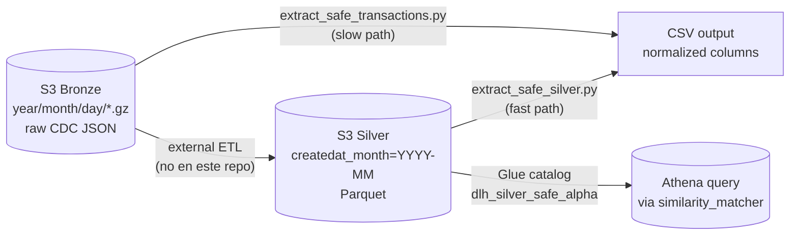

# Data Engineering

**Path:** `data_eng/`
**Maintainers:** Landneyker Betancourth (compartido con equipo DE)

## Purpose

Pipeline ETL Bronze→Silver para extraer y normalizar transacciones de SAFE del datalake AWS. **Offline**, no se ejecuta en línea con el endpoint. Produce los Parquet del Silver layer que después se exponen como tabla Athena (`dlh_silver_safe_alpha.safetransactionresults`) consumida por el endpoint.

## Public surface

Scripts CLI:

| Script | Cuándo se usa |
|---|---|
| `python extract_safe_silver.py` | Extracción rápida desde Silver Parquet (10–100× más rápido que Bronze) |
| `python extract_safe_transactions.py` | Extracción desde Bronze (.gz JSON CDC) — más lento pero raw |
| `python validate_csv.py` | Valida estructura, column order, datetime, nulls de un CSV |
| `python compare_csv_files.py` | Diff de 2 CSVs (rows, columns, date ranges, identifiers) |

## Internal structure

```
data_eng/
├── extract_safe_silver.py        — Reader de Silver Parquet
├── extract_safe_transactions.py  — Reader de Bronze (.gz JSON)
├── validate_csv.py               — Validation de output CSV
├── compare_csv_files.py          — Diff utility
├── README.md                     — Documentación con ejemplos
└── PERFORMANCE.md                — Benchmarks Silver vs Bronze
```

## Flow



## Output schema

Ambos extractors normalizan a las mismas columnas:

| Columna | Tipo | Origen |
|---|---|---|
| `uuid` | string | UUID de la transacción |
| `transactionId` | int | ID de la transacción |
| `idFi` | int | ID de la credit union |
| `statusWarning` | string | `SAFE`, `RISKY`, `NONE` |
| `metadata` | string (JSON) | Payload extendido (incluye decisionResult) |
| `createdAt` | datetime | Timestamp creación |
| `updatedAt` | datetime | Timestamp última actualización |

## Performance

(de `PERFORMANCE.md`)

| Source | ~240 records | Velocidad |
|---|---|---|
| Bronze .gz | 5.8 s | 1× baseline |
| Silver Parquet | 2.0 s | ~3× faster |

Para volúmenes grandes (>10k records), Silver es mandatorio.

## Dependencies

- `boto3` — S3 client
- `pandas` — DataFrame
- `pyarrow>=12` — Parquet reader
- AWS profile: `blossom-dev` (acceso a `blossom-analytics-datalake-dev` y/o `-alpha`)

## Patterns

- **Date filtering** — los extractors soportan `--start YYYY-MM-DD --end YYYY-MM-DD` para limitar el scan
- **Column normalization** — ambos paths producen el mismo schema, así que el resto del sistema no se preocupa por de dónde vinieron los datos
- **Idempotent** — re-correr con mismas fechas → mismo output (módulo cambios en el lago)

## Integración con el endpoint

El endpoint **NO** ejecuta nada de `data_eng/`. Lee directamente Athena (`similarity_matcher.py`) o (legacy, antes de DATA-1264) Parquet de S3. `data_eng/` es la herramienta para:

1. Validar localmente lo que está en el lake
2. Producir CSVs para entrenamiento del modelo K-Means
3. Diff entre versiones del lake
4. Reportes ad-hoc

## Cuenta AWS

| Recurso | Cuenta |
|---|---|
| Bronze bucket `blossom-analytics-datalake-dev` | dev |
| Silver bucket `blossom-analytics-datalake-dev` (silver layer) | dev |
| Silver bucket `blossom-analytics-datalake-alpha` (el que consume el endpoint) | alpha |
| Glue catalog `dlh_silver_safe_alpha` | alpha |

`data_eng/` puede correr contra ambos (dev/alpha) según el flag de profile.

## Tests

(sin test suite dedicado — validación via `validate_csv.py` + diff manual)

## Sub-features

- (sin sub-pages)

## Related concepts

- [[Similarity-Athena]] — cómo el endpoint consume el output de este pipeline
- [[Architecture]] — dónde encaja en el sistema completo

## Backlinks

- [[Architecture]]
- [[Module-Map]]

#data-engineering #etl #parquet #datalake #bronze-silver
